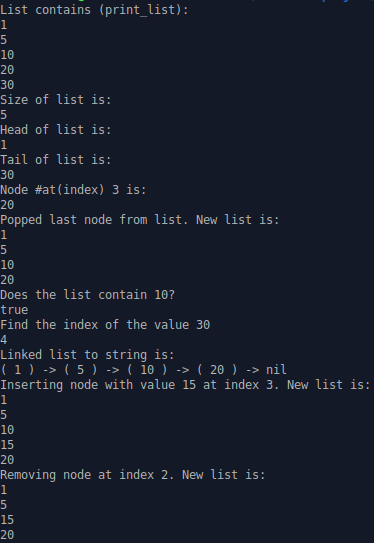

# Linked List

Practicing with one of the most classic and fundamental data structures: the linked list.

Linked lists are similar to arrays, but they have a few benefits. The size of arrays matter in some programming languages. Linked lists allow us to overcome that with dynamically allocated data. This means we can easily insert or remove items from a linked list without having to interrupt and move around other nodes in the linked list.

### Assignment From The Odin Project

Build the following methods in your linked list class:

1. #append(value) adds a new node containing value to the end of the list
2. #prepend(value) adds a new node containing value to the start of the list
3. #size returns the total number of nodes in the list
4. #head returns the first node in the list
5. #tail returns the last node in the list
6. #at(index) returns the node at the given index
7. #pop removes the last element from the list
8. #contains?(value) returns true if the passed in value is in the list and otherwise returns false.
9. #find(value) returns the index of the node containing value, or nil if not found.
10. #to_s represent your LinkedList objects as strings, so you can print them out and preview them in the console. The format should be: ( value ) -> ( value ) -> ( value ) -> nil

Extra Credit

1. #insert_at(value, index) that inserts a new node with the provided value at the given index.
2. #remove_at(index) that removes the node at the give

### Output of Created Methods

